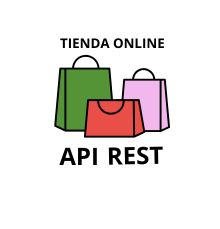

<p align="center"><a href="https://laravel.com" target="_blank"></a></p>


#  API REST Tienda Online

Es una API REST la cual contiene el desarrollo backend de una tienda online, utilizando Laravel como framework PHP. Esta API contiene dos roles Administrador y Usuario.

En el rol del Administrador se pueden realizar las siguientes acciones:
    - Gestión de las categorias
    - Gestión de los productos

En el rol del usuario se pueden realizar las siguientes acciones:
    - Visualización global de los productos.
    - Visualización de los productos por categoria.
    - Agregar productos al carrito.
    - Realizar pedidos.
    - Visualizar el historial de pedidos realizados.
    - Actualizar el perfil del usuario.
    - Obtener recomendaciones de productos por las compras realizadas.

Luego tambien tenemos funcionalidades comunes como es el caso del login, y otras mas como el registro de nuevos usuarios, y la recuperación  de contraseña.

## Endpoints Comunes

### Login
- **Ruta:** `http://localhost:8000/api/login`
- **Método:** `POST`
- **Descripción:** Iniciamos sesion con un usuario.
- **JSON de Ejemplo:**

  ```json
  {
    "email": "ramona.cummerata@moen.com",
    "contrasena": "1234"
  }
  ```

### Registro de usuario
- **Ruta:** `http://localhost:8000/api/registro`
- **Método:** `POST`
- **Descripción:** Creamos un nuevo usuario.
- **JSON de Ejemplo:**

  ```json
  {
    "nombre": "Nombre del usuario",
    "email": "correo3@ejemplo.com",
    "contrasena": "contraseña123",
    "rol": "Administrador"
  }
  ```

### Cerrar Sesion
- **Ruta:** `http://localhost:8000/api/logout`
- **Método:** `POST`
- **Descripción:** Cerramos sesion de un usuario.
- **Necesidades:** Token Bearer

### Recuperar Usuario

## Endpoints del Administrador

### Categorias

#### Crear Categoria
- **Ruta:** `http://localhost:8000/api/admin/categorias`
- **Método:** `POST`
- **Descripción:** Creamos una nueva categoria.
- **JSON de Ejemplo:**
- **Necesidades:** Token Bearer

  ```json
  {
    "nombre": "Ropa"
  }

  ```

#### Ver categorias
- **Ruta:** `http://localhost:8000/api/admin/categorias`
- **Método:** `GET`
- **Descripción:** Obtenemos las categorias existentes.
- **Necesidades:** Token Bearer

#### Ver categoria por ID
- **Ruta:** `http://localhost:8000/api/admin/categorias/{id}`
- **Método:** `GET`
- **Descripción:** Obtenemos una categoria por su id.
- **Necesidades:** Token Bearer

#### Actualizar Categoria por ID
- **Ruta:** `http://localhost:8000/api/admin/categorias/{id}`
- **Método:** `PUT`
- **Descripción:** Actualizamos una categoria por su id.
- **JSON de Ejemplo:**
- **Necesidades:** Token Bearer

  ```json
  {
    "nombre": "Ropa"
  }

  ```

#### Eliminamos Categoria por ID
- **Ruta:** `http://localhost:8000/api/admin/categorias/{id}`
- **Método:** `DELETE`
- **Descripción:** Eliminamos una categoria por su id.
- **Necesidades:** Token Bearer


### Productos

#### Crear nuevo producto
- **Ruta:** `http://localhost:8000/api/admin/productos`
- **Método:** `POST`
- **Descripción:** Creamos un nuevo producto.
- **JSON de Ejemplo:**
- **Necesidades:** Token Bearer

  ```json
  {
  "nombre": "Camiseta QUATRO",
  "img1": "data:image/png;base64,iVBORw0KGgoAAAANSUhEUgAAABAAAAAQCAYAAAAf8/9hAAABkUlEQVR42mL8//8/w3XAIyoAWTHiJz5SgHZVcsVgMxwbQG4GBAXIXuNlPgI8QuAHiOYBWRwMxy8SQPAfzGKkRJhhBlY/gJAVwDNrKyAQWgA2zwQiwTgrZDF8gFgOwQ8+8lgBgZHYIBiPgeBTVgvJ9BWFgAMkcsHoLKCTkx/xHiJTDAGRewGRjQc5SBHgAULQJ2BpgAJqDAJUVQBTE/NgAvBKYADWALQiNHzAmAALEAaAUMvB6AAK6gx1TgWkaXcKlHoFkzgUqCsgFWcAzKAAStA/YNVQByggCWbA4AFApBRwrAoA1OAAfCUJ6Nc3giRWcj+BMpjA/BrbBwhcBLwDJmsAKXGBMFgDNRDEsQGUOAIQlgGwk5gAgmYgBTgGRsQBzUwBoAgBIRUwLLAKCNdAAglpAKqQgx5VHCED8AEOyK5VNCClcJAKqAYUwDYgtAPwG9t5P/3HuLzIAnLN+AAwgxn4CVWIVfMFw2+Et4gaU+AAGaABDAAv5UBbbPMgyAAAAAElFTkSuQmCC",
  "img2": "data:image/png;base64,iVBORw0KGgoAAAANSUhEUgAAABAAAAAQCAYAAAAf8/9hAAABkUlEQVR42mL8//8/w3XAIyoAWTHiJz5SgHZVcsVgMxwbQG4GBAXIXuNlPgI8QuAHiOYBWRwMxy8SQPAfzGKkRJhhBlY/gJAVwDNrKyAQWgA2zwQiwTgrZDF8gFgOwQ8+8lgBgZHYIBiPgeBTVgvJ9BWFgAMkcsHoLKCTkx/xHiJTDAGRewGRjQc5SBHgAULQJ2BpgAJqDAJUVQBTE/NgAvBKYADWALQiNHzAmAALEAaAUMvB6AAK6gx1TgWkaXcKlHoFkzgUqCsgFWcAzKAAStA/YNVQByggCWbA4AFApBRwrAoA1OAAfCUJ6Nc3giRWcj+BMpjA/BrbBwhcBLwDJmsAKXGBMFgDNRDEsQGUOAIQlgGwk5gAgmYgBTgGRsQBzUwBoAgBIRUwLLAKCNdAAglpAKqQgx5VHCED8AEOyK5VNCClcJAKqAYUwDYgtAPwG9t5P/3HuLzIAnLN+AAwgxn4CVWIVfMFw2+Et4gaU+AAGaABDAAv5UBbbPMgyAAAAAElFTkSuQmCC",
  "img3": "data:image/png;base64,iVBORw0KGgoAAAANSUhEUgAAABAAAAAQCAYAAAAf8/9hAAABkUlEQVR42mL8//8/w3XAIyoAWTHiJz5SgHZVcsVgMxwbQG4GBAXIXuNlPgI8QuAHiOYBWRwMxy8SQPAfzGKkRJhhBlY/gJAVwDNrKyAQWgA2zwQiwTgrZDF8gFgOwQ8+8lgBgZHYIBiPgeBTVgvJ9BWFgAMkcsHoLKCTkx/xHiJTDAGRewGRjQc5SBHgAULQJ2BpgAJqDAJUVQBTE/NgAvBKYADWALQiNHzAmAALEAaAUMvB6AAK6gx1TgWkaXcKlHoFkzgUqCsgFWcAzKAAStA/YNVQByggCWbA4AFApBRwrAoA1OAAfCUJ6Nc3giRWcj+BMpjA/BrbBwhcBLwDJmsAKXGBMFgDNRDEsQGUOAIQlgGwk5gAgmYgBTgGRsQBzUwBoAgBIRUwLLAKCNdAAglpAKqQgx5VHCED8AEOyK5VNCClcJAKqAYUwDYgtAPwG9t5P/3HuLzIAnLN+AAwgxn4CVWIVfMFw2+Et4gaU+AAGaABDAAv5UBbbPMgyAAAAAElFTkSuQmCC",
  "descripcion": "Esta es la descripción del producto de prueba.",
  "precio": 199.99,
  "existencias": 50,
  "categoria_id": 8
    }
  ```

#### Ver productos
- **Ruta:** `http://localhost:8000/api/admin/productos`
- **Método:** `GET`
- **Descripción:** Obtenemos los productos existentes.
- **Necesidades:** Token Bearer

#### Ver producto por nombre
- **Ruta:** `http://localhost:8000/api/admin/productos/{nombre}`
- **Método:** `GET`
- **Descripción:** Obtenemos los productos existentes por el nombre.
- **Necesidades:** Token Bearer

#### Actualizar producto por Id
- **Ruta:** `http://localhost:8000/api/admin/productos/{id}`
- **Método:** `PUT`
- **Descripción:** Actualizamos un producto por su Id.
- **JSON de Ejemplo:**
- **Necesidades:** Token Bearer

  ```json
  {
  "nombre": "Camiseta QUATRO",
  "img1": "data:image/png;base64,iVBORw0KGgoAAAANSUhEUgAAABAAAAAQCAYAAAAf8/9hAAABkUlEQVR42mL8//8/w3XAIyoAWTHiJz5SgHZVcsVgMxwbQG4GBAXIXuNlPgI8QuAHiOYBWRwMxy8SQPAfzGKkRJhhBlY/gJAVwDNrKyAQWgA2zwQiwTgrZDF8gFgOwQ8+8lgBgZHYIBiPgeBTVgvJ9BWFgAMkcsHoLKCTkx/xHiJTDAGRewGRjQc5SBHgAULQJ2BpgAJqDAJUVQBTE/NgAvBKYADWALQiNHzAmAALEAaAUMvB6AAK6gx1TgWkaXcKlHoFkzgUqCsgFWcAzKAAStA/YNVQByggCWbA4AFApBRwrAoA1OAAfCUJ6Nc3giRWcj+BMpjA/BrbBwhcBLwDJmsAKXGBMFgDNRDEsQGUOAIQlgGwk5gAgmYgBTgGRsQBzUwBoAgBIRUwLLAKCNdAAglpAKqQgx5VHCED8AEOyK5VNCClcJAKqAYUwDYgtAPwG9t5P/3HuLzIAnLN+AAwgxn4CVWIVfMFw2+Et4gaU+AAGaABDAAv5UBbbPMgyAAAAAElFTkSuQmCC",
  "img2": "data:image/png;base64,iVBORw0KGgoAAAANSUhEUgAAABAAAAAQCAYAAAAf8/9hAAABkUlEQVR42mL8//8/w3XAIyoAWTHiJz5SgHZVcsVgMxwbQG4GBAXIXuNlPgI8QuAHiOYBWRwMxy8SQPAfzGKkRJhhBlY/gJAVwDNrKyAQWgA2zwQiwTgrZDF8gFgOwQ8+8lgBgZHYIBiPgeBTVgvJ9BWFgAMkcsHoLKCTkx/xHiJTDAGRewGRjQc5SBHgAULQJ2BpgAJqDAJUVQBTE/NgAvBKYADWALQiNHzAmAALEAaAUMvB6AAK6gx1TgWkaXcKlHoFkzgUqCsgFWcAzKAAStA/YNVQByggCWbA4AFApBRwrAoA1OAAfCUJ6Nc3giRWcj+BMpjA/BrbBwhcBLwDJmsAKXGBMFgDNRDEsQGUOAIQlgGwk5gAgmYgBTgGRsQBzUwBoAgBIRUwLLAKCNdAAglpAKqQgx5VHCED8AEOyK5VNCClcJAKqAYUwDYgtAPwG9t5P/3HuLzIAnLN+AAwgxn4CVWIVfMFw2+Et4gaU+AAGaABDAAv5UBbbPMgyAAAAAElFTkSuQmCC",
  "img3": "data:image/png;base64,iVBORw0KGgoAAAANSUhEUgAAABAAAAAQCAYAAAAf8/9hAAABkUlEQVR42mL8//8/w3XAIyoAWTHiJz5SgHZVcsVgMxwbQG4GBAXIXuNlPgI8QuAHiOYBWRwMxy8SQPAfzGKkRJhhBlY/gJAVwDNrKyAQWgA2zwQiwTgrZDF8gFgOwQ8+8lgBgZHYIBiPgeBTVgvJ9BWFgAMkcsHoLKCTkx/xHiJTDAGRewGRjQc5SBHgAULQJ2BpgAJqDAJUVQBTE/NgAvBKYADWALQiNHzAmAALEAaAUMvB6AAK6gx1TgWkaXcKlHoFkzgUqCsgFWcAzKAAStA/YNVQByggCWbA4AFApBRwrAoA1OAAfCUJ6Nc3giRWcj+BMpjA/BrbBwhcBLwDJmsAKXGBMFgDNRDEsQGUOAIQlgGwk5gAgmYgBTgGRsQBzUwBoAgBIRUwLLAKCNdAAglpAKqQgx5VHCED8AEOyK5VNCClcJAKqAYUwDYgtAPwG9t5P/3HuLzIAnLN+AAwgxn4CVWIVfMFw2+Et4gaU+AAGaABDAAv5UBbbPMgyAAAAAElFTkSuQmCC",
  "descripcion": "Esta es la descripción del producto de prueba.",
  "precio": 199.99,
  "existencias": 50,
  "categoria_id": 8
    }
  ```

#### Eliminamos Producto por ID
- **Ruta:** `http://localhost:8000/api/admin/productos/{id}`
- **Método:** `DELETE`
- **Descripción:** Eliminamos un producto por su id.
- **Necesidades:** Token Bearer

## Endpoints del Usuario

### Visualización de productos

#### Ver productos
- **Ruta:** `http://localhost:8000/api/usuario/productos`
- **Método:** `GET`
- **Descripción:** Obtenemos los productos existentes.
- **Necesidades:** Token Bearer
  
#### Ver producto por Id
- **Ruta:** `http://localhost:8000/api/usuario/productos/{id}`
- **Método:** `GET`
- **Descripción:** Obtenemos un producto por su Id.
- **Necesidades:** Token Bearer

### Gestión de cestas

#### Crear Cesta
- **Ruta:** `http://localhost:8000/api/admin/categorias`
- **Método:** `POST`
- **Descripción:** Creamos una nueva cesta.
- **JSON de Ejemplo:**
- **Necesidades:** Token Bearer

  ```json
  {
  "usuario_id": 28,
  "total": 0,
  "estado": "abierta"
  }

  ```

#### Ver cesta abierta del usuario
- **Ruta:** `http://localhost:8000/api/usuario/productos/{id}`
- **Método:** `GET`
- **Descripción:** Obtenemos la primera cesta abierta del usuario
- **Necesidades:** Token Bearer

#### Cerrar Cesta
- **Ruta:** `http://localhost:8000/api/usuario/cerrar/cesta/{id}`
- **Método:** `PUT`
- **Descripción:** Cerramos una cesta.
- **Necesidades:** Token Bearer

### Gestión del carrito

#### Añadir Producto
- **Ruta:** `http://localhost:8000/api/admin/categorias`
- **Método:** `POST`
- **Descripción:** Añadimos un producto a la cesta.
- **JSON de Ejemplo:**
- **Necesidades:** Token Bearer

  ```json
  {
    "cesta_id": 1,
    "producto_id": 4,
    "cantidad": 3,
    "precio_unitario": 100.00,
    "subtotal": 300.00
  }
  ```
#### Actualizar Producto de la cesta por Id
- **Ruta:** `http://localhost:8000/api/usuario/actualizar/producto/{id}`
- **Método:** `PUT`
- **Descripción:** Actualizamos un producto a la cesta.
- **JSON de Ejemplo:**
- **Necesidades:** Token Bearer

  ```json
  {
    "cesta_id": 1,
    "producto_id": 5,
    "cantidad": 2,
    "precio_unitario": 100.00,
    "subtotal": 200.00
  }
  ```

#### Eliminar producto de la cesta
- **Ruta:** `http://localhost:8000/api/usuario/eliminar/producto/{id}`
- **Método:** `DELETE`
- **Descripción:** Eliminamos el producto de la cesta.
- **Necesidades:** Token Bearer

### Gestión de Pagos

#### Simulación de pago con stripe
- **Ruta:** `http://localhost:8000/api/usuario/stripe`
- **Método:** `PUT`
- **Descripción:** Actualizamos un producto a la cesta.
- **JSON de Ejemplo:**
- **Necesidades:** Token Bearer

  ```json
  {
    "amount": 10000,
    "currency": "eur",
    "stripeToken": "tok_visa"
  }
  ```

### Algoritmo

#### Recomendaciones para el usuario
- **Ruta:** `http://localhost:8000/api/usuario/productos/recomendaciones/{id}`
- **Método:** `GET`
- **Descripción:** Buscamos recomendaciones de productos para el usuario
- **Necesidades:** Token Bearer

## Autor

- [Manuel García Díaz](https://github.com/mgarciad34)
